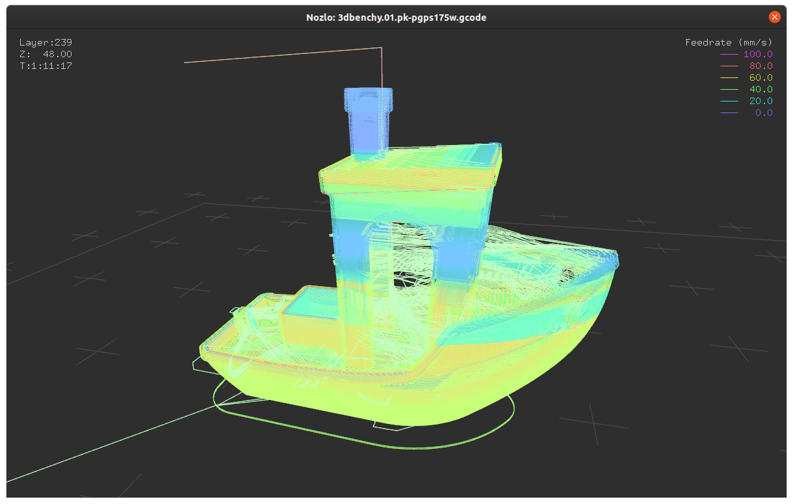
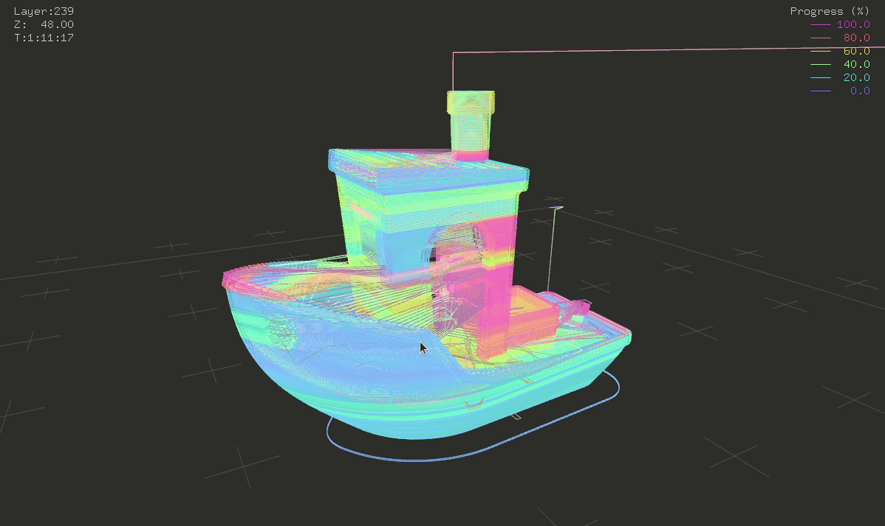
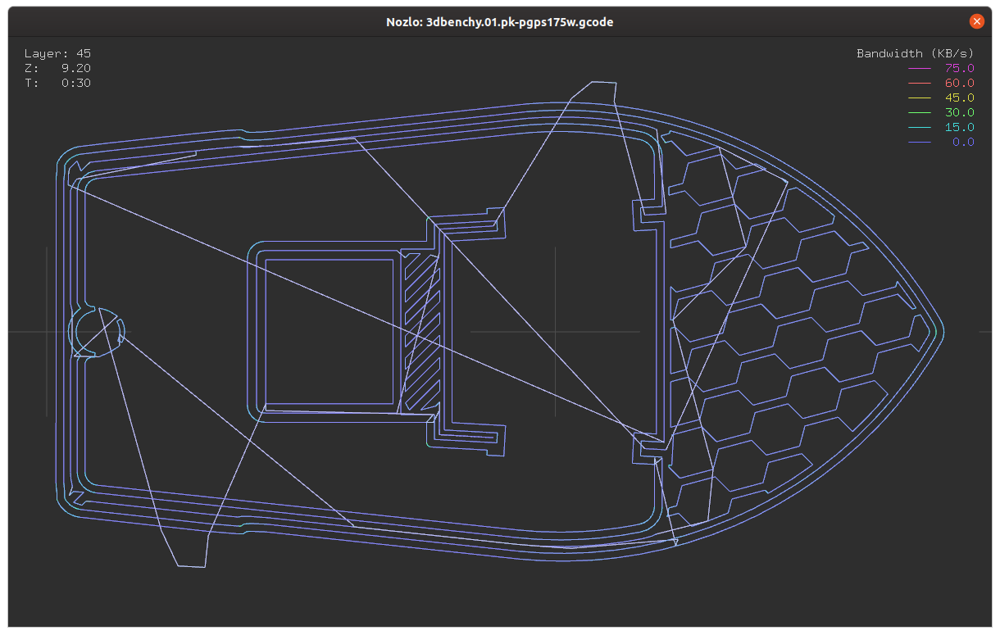
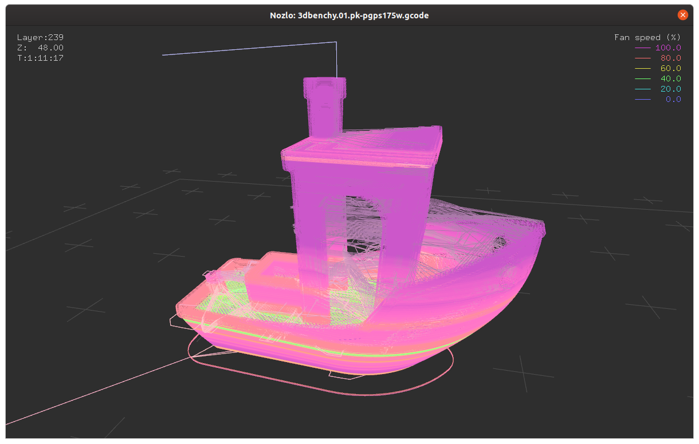

# Nozlo

G-code viewer for visualising feedrate, bandwidth, fan speed, and temperature.







## Installation

Nozlo requires Python 3.7 and an OpenGL-compatible display driver.

```
python3 -m pip install -e git+https://github.com/ianmackinnon/nozlo#egg=nozlo
```


## Usage

```
usage: nozlo [-h] [--verbose] [--quiet] [--version] [--no-cache]
             [--channel {feedrate,bandwidth,fan_speed,tool_temp,bed_temp}]
             [--layer LAYER] [--single] [--ortho] [--aim AIM AIM AIM]
             [--yaw YAW] [--pitch PITCH] [--dist DIST]
             GCODE

G-code viewer.

positional arguments:
  GCODE                 Path to G-code file.

optional arguments:
  -h, --help            show this help message and exit
  --verbose, -v         Print verbose information for debugging.
  --quiet, -q           Suppress warnings.
  --version, -V         show program's version number and exit
  --no-cache, -C        Bypass model cache and previous settings.
  --channel {progress,feedrate,bandwidth,fan_speed,tool_temp,bed_temp}, -c {progress,feedrate,bandwidth,fan_speed,tool_temp,bed_temp}
                        Channel to display.
  --layer LAYER, -l LAYER
                        Layer number to display, from 0 to n-1, or `first` or
                        `last` to indicate the first layer containing the
                        model or last layer.
  --single, -s          Show only the single current layer.
  --explode, -x         Explode current layer progress along the Z-axis.
  --ortho, -o           Use orthographic projection.
  --aim AIM AIM AIM, -a AIM AIM AIM
                        Aim coordinates for the camera.
  --yaw YAW, -Y YAW     Camera yaw in degrees, starting in positive X and
                        moving clockwise (looking down) around the aim point.
  --pitch PITCH, -P PITCH
                        Camera pitch in degrees, positive puts the camera
                        above the aim point.
  --dist DIST, -D DIST  Camera distance in mm for perspective view. Camera
                        frame in mm for orthographic view
```


## Controls

Mouse:

-   **Left drag**: Tumble camera
-   **Right drag**: Dolly camera
-   **Scroll**: Zoom camera

Keyboard

-   **0**: Show progress
-   **1**: Show feedrate
-   **2**: Show G-code bandwidth
-   **3**: Show fan speed
-   **4**: Show tool temperature
-   **5**: Show bed temperature

-   **Home**: toggle between first model layer and first movement layer
-   **End**: toggle between last model layer and first movement layer
-   **Up**: go up a layer
-   **Down**: go down a layer
-   **Page Up**: go up 20% of the model
-   **Page Down**: go down 20% of the model
-   **S**: toggle showing single layer
-   **X**: toggle exploded layer progress view

-   **F**: frame model in camera
-   **A**: frame reference geometry (eg. build surface) in camera
-   **I**: point camera at top of model (towards negative Z)
-   **H**: point camera at left of model (towards positive X)
-   **J**: point camera at front of model (towards positive Y)
-   **K**: point camera at right of model (towards negative X)
-   **L**: point camera at back of model (towards negative Y)
-   **U**: point camera at bottom of model (towards positive Z)
-   **Y**: reset camera to point diagonally at model
-   **-**: zoom out
-   **=**: zoom in

-   **,**: decrease exploded view scale
-   **.**: increase exploded view scale

-   **O**: toggle orthographic/perspective projection

-   **Q**/**Escape**: Quit

