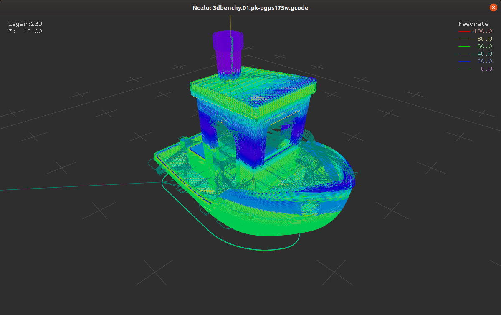

# Nozlo

G-code viewer for visualising feedrate




## Installation

Nozlo requires Python 3.7 and an OpenGL-compatible display driver.

```
python3 -m pip install -e git+https://github.com/ianmackinnon/nozlo#egg=nozlo
```


## Usage

```
usage: nozlo [-h] [--verbose] [--quiet] [--version] GCODE

G-code viewer.

positional arguments:
  GCODE          Path to G-code file.

optional arguments:
  -h, --help     show this help message and exit
  --verbose, -v  Print verbose information for debugging.
  --quiet, -q    Suppress warnings.
  --version, -V  show program's version number and exit

```

